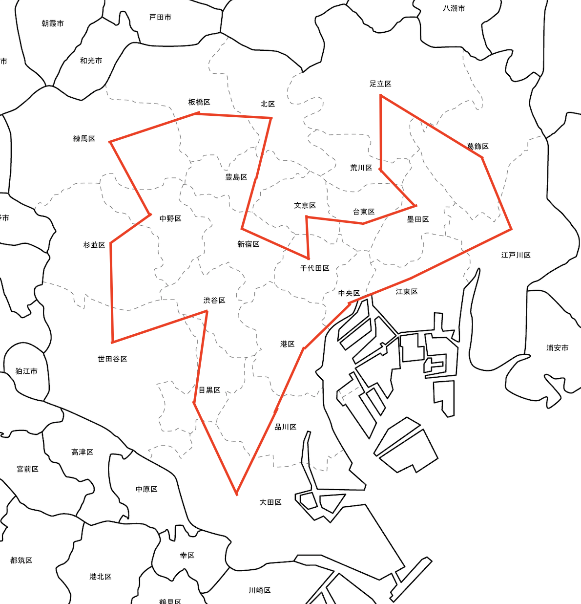

# tokyo-word-offices



上記の地図は[白地図専門店](https://www.freemap.jp/)からダウンロードさせて頂いた白地図もとに作成しました。

## What

東京23区の全ての区役所を巡って再び出発点の区役所に戻る時、総距離が可能な限り短くなる訪問の順番を求めるプログラムです。
アルゴリズムには、[遺伝的アルゴリズム](https://ja.wikipedia.org/wiki/%E9%81%BA%E4%BC%9D%E7%9A%84%E3%82%A2%E3%83%AB%E3%82%B4%E3%83%AA%E3%82%BA%E3%83%A0)の考え方を取り入れました。

アルゴリズムの性質上、出力は一定ではありません。
最適な答えが出力される保証はありませんが、短い時間でそれなりの出力を得られます。

汎用的に問題を扱えるようにアルゴリズムの本質的なコードと、その他のコード、およびデータを分離しました。
例えば、アルゴリズムの本質的なコードを修正せずに都道府県庁所在地を巡るコードを追加できるようにしました。

## 下準備

Google マップを使い、各区役所間の最短経路をCSVファイルに落とし込みました。
交通手段は作者の趣味である自転車を選びました。
例えば、[千代田区役所 - 中央区役所](https://www.google.co.jp/maps/dir/%E3%80%92102-8688+%E6%9D%B1%E4%BA%AC%E9%83%BD%E5%8D%83%E4%BB%A3%E7%94%B0%E5%8C%BA%E4%B9%9D%E6%AE%B5%E5%8D%97%EF%BC%91%E4%B8%81%E7%9B%AE%EF%BC%92%E2%88%92%EF%BC%91+%E5%8D%83%E4%BB%A3%E7%94%B0%E5%8C%BA%E5%BD%B9%E6%89%80/%E4%B8%AD%E5%A4%AE%E5%8C%BA%E5%BD%B9%E6%89%80%E3%80%81%E3%80%92104-0045+%E6%9D%B1%E4%BA%AC%E9%83%BD%E4%B8%AD%E5%A4%AE%E5%8C%BA%E7%AF%89%E5%9C%B0%EF%BC%91%E4%B8%81%E7%9B%AE%EF%BC%91%E2%88%92%EF%BC%91/@35.6823341,139.7569932,15z/data=!3m1!5s0x60188cb0939529d3:0xbfe22f2b6c50e2e3!4m14!4m13!1m5!1m1!1s0x60188c13425af13d:0x95f46fd8e714d412!2m2!1d139.7534466!2d35.6940438!1m5!1m1!1s0x60188be011e654a9:0xbdf6e9f103a900a5!2m2!1d139.7719937!2d35.6706329!3e1?hl=ja)は、2021-07-03現在の最短距離が4.4kmでした。

隣接していない区の区役所間の距離は1,000km固定としました。
区の境界を調べるにあたって、[標準地域コード インデックス | 歴史的行政区域データセットβ版](https://geoshape.ex.nii.ac.jp/city/code/?%E6%9D%B1%E4%BA%AC%E9%83%BD)を参考にさせて貰いました(地図情報を調べなくてもわかりそうな気がしますが)。

## 実行結果

現時点で下記の結果が最短距離です。

```
119.59999999999998
[千代田, 新宿, 豊島, 北, 板橋, 練馬, 中野, 杉並, 世田谷, 渋谷, 目黒, 大田, 品川, 港, 中央, 江東, 江戸川, 葛飾, 足立, 荒川, 墨田, 台東, 文京]
[千代田, 文京, 台東, 墨田, 荒川, 足立, 葛飾, 江戸川, 江東, 中央, 港, 品川, 大田, 目黒, 渋谷, 世田谷, 杉並, 中野, 練馬, 板橋, 北, 豊島, 新宿]
```

1行目が総距離、2行目と3行目は区役所を巡る順番です。
実行結果を比較しやすいように必ず千代田区を基準として右回りと左回りを出力しています。
どちらが右回りかの判定はしていないので、順不同で出力しています。

見やすくする為に箇条書きで示します。
出発点になった区役所に戻るルールですので、どの区役所から出発してもよいです。

1. 千代田
1. 文京
1. 台東
1. 墨田
1. 荒川
1. 足立
1. 葛飾
1. 江戸川
1. 江東
1. 中央
1. 港
1. 品川
1. 大田
1. 目黒
1. 渋谷
1. 世田谷
1. 杉並
1. 中野
1. 練馬
1. 板橋
1. 北
1. 豊島
1. 新宿
1. 千代田

冒頭の白地図は、上記の結果をもとに手動で作成したものです。
作業時間の都合で作成した大雑把な表現であり、実際の区役所の位置、および経路を反映したものではありません。

実際に自転車で区役所を巡る場合は、Google マップの経路検索結果をもとに現場の交通状況に合わせて安全に走行する必要がありますw

## アルゴリズムの解説

準備中

## 課題

総当りで計算すると膨大な組み合わせになるため、このプログラムを使う価値があります。
しかし、今回は隣接していない区間の経路を実質的に除外しています。
その条件であれば、総当たりでも十分計算できるのではないかと思います。

また、下準備と地図への結果を反映を可能な限り自動化したいです。

## Build
* Given
  * Java 11 or later

* Mac

  ```
  $ ./gradlew build
  ```

* Windows

  ```
  $ gradlew.bat build
  ```

## Execute

* Mac

  ```
  $ ./gradlew run
  ```

* Windows

  ```
  $ gradlew.bat run
  ```
